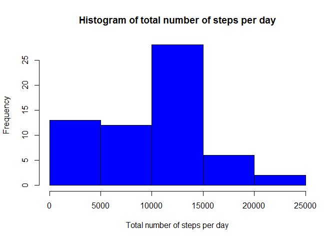
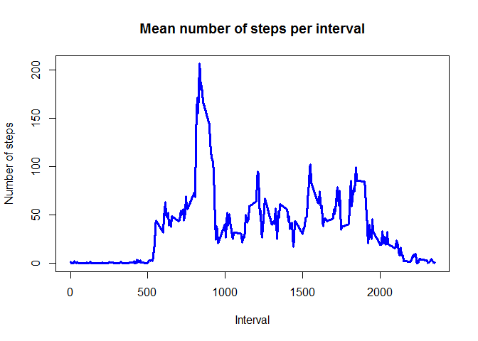
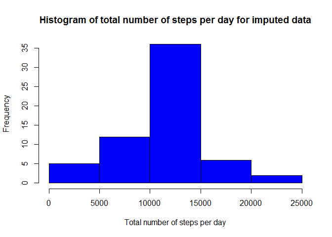
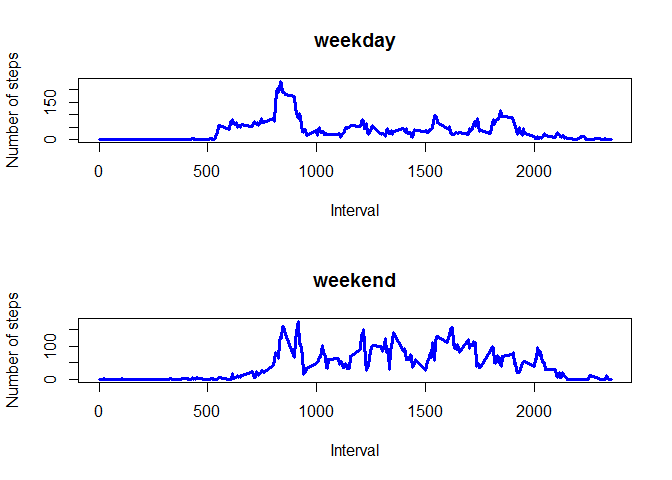

# Reproducible Research: Peer Assessment 1
## Introduction
It is now possible to collect a large amount of data about personal movement using activity monitoring devices such as a Fitbit, Nike Fuelband, or Jawbone Up. These type of devices are part of the "quantified self" movement -- a group of enthusiasts who take measurements about themselves regularly to improve their health, to find patterns in their behavior, or because they are tech geeks. But these data remain under-utilized both because the raw data are hard to obtain and there is a lack of statistical methods and software for processing and interpreting the data.

This assignment makes use of data from a personal activity monitoring device. This device collects data at 5 minute intervals through out the day. The data consists of two months of data from an anonymous individual collected during the months of October and November, 2012 and include the number of steps taken in 5 minute intervals each day.

## Data
The data for this assignment can be downloaded from the course web site:

* Dataset: [Activity monitoring data](https://d396qusza40orc.cloudfront.net/repdata%2Fdata%2Factivity.zip) [52K]

The variables included in this dataset are:

* steps: Number of steps taking in a 5-minute interval (missing values are coded as NA)

* date: The date on which the measurement was taken in YYYY-MM-DD format

* interval: Identifier for the 5-minute interval in which measurement was taken

## Loading and preprocessing the data
Data is assumed to be in the working directory, as a file named "activity.csv".
Reading the data into a data.frame and computing its dimensions:

```r
DF <- read.csv("activity.csv", colClasses=c("numeric", "Date", "numeric"))
dim(DF)
```

```
## [1] 17568     3
```

## What is mean total number of steps taken per day?
Calculating a vector with the total number of steps taken per day:

```r
totalPerDay <- tapply(DF$steps, DF$date, sum, na.rm=T)
```

Plotting a histogram of this vector:

```r
hist(totalPerDay, col="blue",
     xlab="Total number of steps per day", main="Histogram of total number of steps per day")
```

 

Calculating mean and median of this vector:

```r
mn <- mean(totalPerDay, na.rm=T)
mdn <- median(totalPerDay, na.rm=T)
```

The mean of the total number of steps taken per day is 9354.2295082, and the median is 1.0395\times 10^{4}.


## What is the average daily activity pattern?
Computing the vector of average number of steps taken per each interval over all the days in the dataset:

```r
meanPerInterval <- tapply(DF$steps, DF$interval, mean, na.rm=T)
```

Plotting average number of steps per interval vs. the interval value:

```r
plot(names(meanPerInterval), meanPerInterval, type="l", col="blue", lwd=3,
     xlab="Interval", ylab="Number of steps", main="Mean number of steps per interval")
```

 

Finding the interval with the maximal mean number of steps:

```r
valMaxMeanPerInterval <- max(meanPerInterval)
maxMeanPerInterval <- names(which.max(meanPerInterval))
```
Maximal value is 206.1698113 at interval 835.


## Imputing missing values
Calculating the total number of missing values in the dataset (a missing value is any row which contains "NA"):

```r
totalNA <- sum(is.na(DF$steps) | is.na(DF$interval) | is.na(DF$date))
```
The total number of missing values is 2304.

For each row with missing number of steps, fill in the mean number of steps for the relevant interval:

```r
DFnoNA <- DF
for (i in 1:length(DF$steps)) {
        if (is.na(DF$steps[i])) DFnoNA$steps[i] <- meanPerInterval[as.character(DF$interval[i])]
}
```

Plot the histogram for total number of steps per day, for the imputed data:

```r
totalPerDayImputed <- tapply(DFnoNA$steps, DFnoNA$date, sum)
hist(totalPerDayImputed, col="blue", 
          xlab="Total number of steps per day", main="Histogram of total number of steps per day for imputed data")
```

 

```r
mnImputed <- mean(totalPerDayImputed, na.rm=T)
mdnImputed <- median(totalPerDayImputed, na.rm=T)
if (mn == mnImputed) {
        change <- "The new values are equal to the original values"
        } else {
                change <- "The new values are higher than the original values"
                }
```
For the imputed dataset, the mean of the total number of steps taken per day is 1.0766189\times 10^{4}, and the median is 1.0766189\times 10^{4}. The new values are higher than the original values.


## Are there differences in activity patterns between weekdays and weekends?
Adding a new factor variable with two levels, "weekday" and "weekend", according to the 'date' variable.

```r
DF$dayType <- factor(weekdays(DF$date)=="Saturday" | weekdays(DF$date)=="Sunday", 
                     levels=c("TRUE", "FALSE"),
                     labels=c("weekend", "weekday"))
```


Computing the per-interval-mean separately for weekdays and weekends:

```r
DFbyDayType <- split(DF, DF$dayType)
weekdayMeanPerInterval <- tapply(DFbyDayType[["weekday"]]$steps, DFbyDayType[["weekday"]]$interval, mean, na.rm=T)
weekendMeanPerInterval <- tapply(DFbyDayType[["weekend"]]$steps, DFbyDayType[["weekend"]]$interval, mean, na.rm=T)
```

Plotting the weekday/weekend per-interval-mean:

```r
par(mfrow=c(2,1))
plot(names(weekdayMeanPerInterval), weekdayMeanPerInterval, type="l", col="blue", lwd=3,
     xlab="Interval", ylab="Number of steps", main="weekday")
plot(names(weekendMeanPerInterval), weekendMeanPerInterval, type="l", col="blue", lwd=3,
     xlab="Interval", ylab="Number of steps", main="weekend")
```

 

